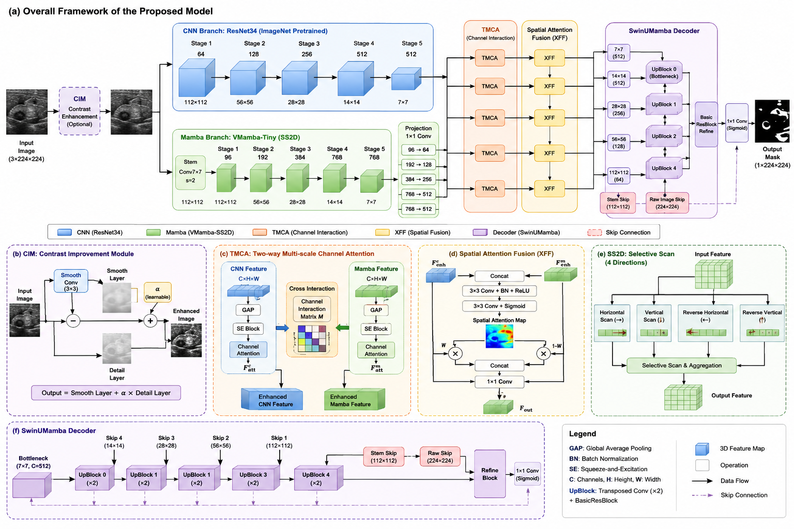

# SwinMamba + ResNet34 + CIM + SwinDecoder

[](https://www.python.org/)
[](https://pytorch.org/)

**双分支医学图像分割模型** — 融合 CNN 局部细节 与 Mamba (SS2D) 全局上下文，面向乳腺超声（BreastUS）和细胞核（MoNuSeg）分割任务。

---

## 📸 模型结构图



> 完整架构解析请参阅 [architecture_analysis.md](architecture_analysis.md)

---

## 🧠 架构概览

```
输入图像 (3×224×224)
    │
    ├── CIM 对比度增强 ────────────────────────┐
    │                                          │
    ├── ResNet34 Encoder (CNN)                 │
    │   ├─ Stage1: 64ch @56                    │
    │   ├─ Stage2: 128ch @28                   │
    │   ├─ Stage3: 256ch @14                   │
    │   └─ Stage4: 512ch @7                    │
    │                                          │
    ├── VMamba-Tiny Encoder (Mamba/SS2D)       │
    │   ├─ Stem (Conv7×7 s=2) → 48ch           │
    │   ├─ Stage1: 96ch @56                    │
    │   ├─ Stage2: 192ch @28                   │
    │   ├─ Stage3: 384ch @14                   │
    │   └─ Stage4: 768ch @7                    │
    │                                          │
    ├── Conv1×1 通道投影 ──────────────────────│
    │                                          │
    ├── TMCA 通道交互注意力 (4 Stages) ─────────│
    │   └── SpatialAttentionFusion 空间融合 ───│
    │                                          │
    └── SwinUMambaDecoder ────────── raw skip ◄┘
        ├─ UpBlock ×5（转置卷积上采样）
        ├─ BasicResBlock 跳跃连接
        └─ Conv1×1 → 输出掩膜 (1×224×224)
```

### 核心创新点

| 模块                             | 创新                                                      |
| -------------------------------- | --------------------------------------------------------- |
| **CIM**                    | 可学习对比度增强，平滑层+细节层分解，α 自适应缩放        |
| **SS2D**                   | 四方向选择性扫描，O(N) 线性复杂度，纯PyTorch跨平台回退    |
| **TMCA**                   | CNN↔Mamba 双向通道交互注意力，SEBlock 筛选后交叉查询     |
| **SpatialAttentionFusion** | 空间自适应权重 + 残差连接 + 互补权重 (weight vs 1-weight) |
| **SwinUMambaDecoder**      | Raw Image Skip + 多级跳跃连接 + Deep Supervision          |

---

## 📁 项目结构

```
Swinmamba_resnet34_CIM_swindecoder/
├── models/
│   ├── model.py              # 主模型 (CIM, TMCA, XFF, ResNet34, Decoder)
│   └── swin_umamba.py        # VMamba-Tiny 编码器 + SS2D 算子
├── datasets/
│   ├── dataset_synapse.py    # 数据集加载 & 增强 pipeline
│   └── preprocessed_monuseg.py
├── train.py                  # 训练入口 & 参数配置
├── trainer.py                # 训练循环、验证、WarmupPolyLR、早停
├── test.py                   # 测试/推理脚本 (支持滑窗 & 直接resize)
├── utils.py                  # 损失函数 (Focal Tversky / Dice+Focal) & 评估指标
├── architecture_analysis.md  # 详细架构解析文档
├── model_structure.png       # 模型结构图
└── train_test.md             # 训练启动指南
```

---

## 🚀 快速开始

### 环境要求

- Python 3.8+
- PyTorch 2.0+
- CUDA 11.8+ (推荐，非必须)

```bash
pip install torch torchvision
pip install numpy scipy medpy SimpleITK tensorboardX tqdm
pip install timm einops
pip install h5py Pillow opencv-python scikit-image
```

### 训练

```bash
# 默认配置训练 (BreastUS)
python train.py

# MoNuSeg 细胞核分割
python train.py --dataset MoNuSeg --batch_size 16 --max_epochs 130

# 完整训练配置
python train.py \
    --dataset MoNuSeg \
    --batch_size 16 \
    --max_epochs 130 \
    --base_lr 0.0003 \
    --load_pretrained True \
    --use_cim 1 \
    --loss_type focal_tversky \
    --deep_supervision 1 \
    --early_stopping_patience 50
```

### 测试

```bash
# 滑窗推理 (推荐)
python test.py \
    --dataset MoNuSeg \
    --split test \
    --model ./output/xxx/best_model.pth \
    --test-mode sliding_window \
    --deep-supervision 1

# 直接 resize 推理
python test.py \
    --dataset BreastUS \
    --split test \
    --model ./output/xxx/best_model.pth \
    --test-mode direct_resize
```

---

## ⚙️ 关键参数

| 参数                          | 默认值            | 说明                                          |
| ----------------------------- | ----------------- | --------------------------------------------- |
| `--dataset`                 | `BreastUS`      | 数据集:`BreastUS`, `MoNuSeg`, `Synapse` |
| `--img_size`                | `224`           | 输入图像尺寸                                  |
| `--batch_size`              | `16`            | 批大小                                        |
| `--max_epochs`              | `130`           | 最大训练轮数                                  |
| `--base_lr`                 | `0.0003`        | 初始学习率                                    |
| `--use_cim`                 | `1`             | 启用对比度增强                                |
| `--loss_type`               | `focal_tversky` | 损失函数:`focal_tversky` / `dice_focal`   |
| `--deep_supervision`        | `0`             | 启用深层监督                                  |
| `--load_pretrained`         | `False`         | 加载预训练权重                                |
| `--freeze_mamba_encoder`    | `0`             | 冻结 Mamba 编码器                             |
| `--early_stopping_patience` | `0`             | 早停 patience (0=禁用)                        |

---

## 📊 评估指标 (MICCAI 标准)

| 指标                | 说明                             |
| ------------------- | -------------------------------- |
| **Dice**      | Sørensen-Dice 重叠系数 ↑       |
| **HD95**      | 95% Hausdorff 距离（边界误差）↓ |
| **ASD**       | 平均表面距离 ↓                  |
| **IoU**       | 交并比 (Jaccard) ↑              |
| **Recall**    | 敏感性 TP/(TP+FN) ↑             |
| **Precision** | 精确度 TP/(TP+FP) ↑             |

---

## 🔬 训练策略

- **优化器**: AdamW (lr=3e-4, weight_decay=3e-5)
- **学习率调度**: WarmupPolyLR (10 epoch warm-up, power=0.9 poly decay)
- **损失函数**: Focal Tversky Loss (α=0.6, β=0.4, γ=2.5)
- **Bias-prior 初始化**: 根据训练集前景占比自动计算
- **早停**: 监控验证集 Dice，恢复最佳模型权重
- **数据增强**: 随机旋转±15°、翻转、亮度/对比度/模糊、CoarseDropout、弹性变形、染色增强

---

## 📈 模型参数量

| 模块                       | 参数量           | 状态          |
| -------------------------- | ---------------- | ------------- |
| CIM                        | ~18              | 可训练        |
| ResNet34 Encoder           | ~21.3M           | 可训练        |
| VMamba-Tiny Encoder        | ~13.4M           | 默认冻结      |
| 通道投影层                 | ~0.55M           | 可训练        |
| TMCA ×4                   | ~1.1M            | 可训练        |
| SpatialAttentionFusion ×4 | ~1.6M            | 可训练        |
| SwinUMambaDecoder          | ~4.0M            | 可训练        |
| **总计**             | **~41.8M** | 可训练 ~28.4M |

---

## 📚 引用

本项目融合了以下工作的方法：

- **ResNet**: He et al., "Deep Residual Learning for Image Recognition", CVPR 2016
- **VMamba / SS2D**: Liu et al., "VMamba: Visual State Space Model", 2024
- **Swin-UMamba**: Liu et al., "Swin-UMamba: Mamba-based UNet with ImageNet-based pretraining", 2024
- **Focal Tversky Loss**: Abraham & Khan, "A Novel Focal Tversky Loss for Unbalanced Biomedical Image Segmentation", ISBI 2019
